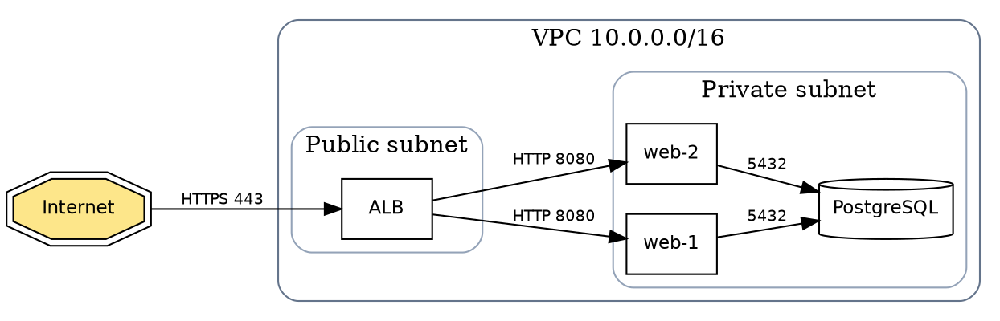

# Graphviz DOT for network topology

Use DOT when you want precise control over layout, ranking, and clustering
and **don't** need provider icons. It's the engine under the `diagrams`
library, so reaching for it directly trades icons for control. If you want
provider glyphs, use `references/diagrams-python.md`; if you want zero
install, use Mermaid.

## Setup & render

```bash
# install the engine (Debian/Ubuntu: sudo apt-get install -y graphviz)
dot -Tpng topology.dot -o topology.png     # or -Tsvg / -Tpdf
```

## Core idioms for network diagrams

- `rankdir=LR` for request flows (left→right), `TB` for layered stacks.
- `subgraph cluster_x { label="..." }` — the `cluster_` name prefix is what
  makes Graphviz draw the labeled bounding box for a VPC/subnet/zone. Without
  that prefix you get no box.
- Edge labels carry the protocol/port: `a -> b [label="443"]`.
- Node `shape=` encodes type: `box` = service, `cylinder` = database,
  `component` = app, `doubleoctagon` = external/internet.

## Recipe: VPC with public/private subnets



## Keeping layout under control

- **Force a layer order** with an invisible chain when the engine reorders
  ranks awkwardly: `edge_a -> edge_b [style=invis];`.
- **Align peers on the same rank** with `{ rank=same; web1; web2; web3; }`.
- **Straighten a busy graph** with `splines=ortho;` (right-angle edges, reads
  like a network diagram) or `splines=polyline;`.
- **Thin out clutter** with `nodesep=0.4; ranksep=0.7;` at the graph level.

## Recipe: hub-and-spoke

```dot
digraph hubspoke {
  layout=neato;               // radial layout suits hub topologies
  hub [shape=box, style=filled, fillcolor="#bfdbfe", label="Transit VPC"];
  hub -- s1; hub -- s2; hub -- s3; hub -- s4;
  s1 [label="Spoke: prod"];
  s2 [label="Spoke: staging"];
  s3 [label="Spoke: data"];
  s4 [label="Spoke: shared-svc"];
  edge [dir=none];
}
```

For undirected topology (physical links, peering) use `graph`/`--` and
`dir=none`; for directed request/data flow use `digraph`/`->`.
