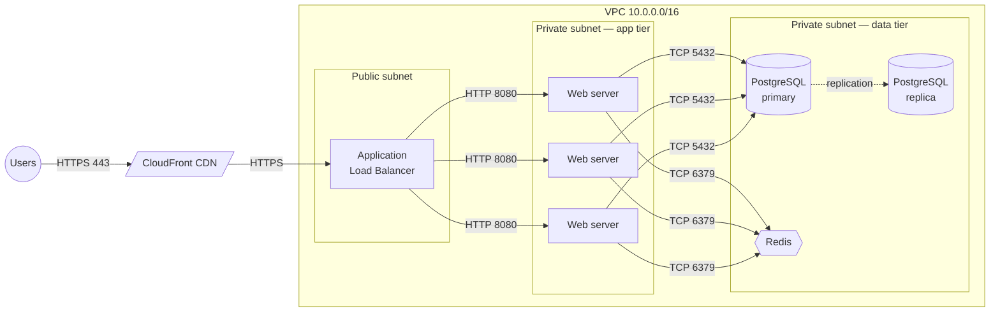
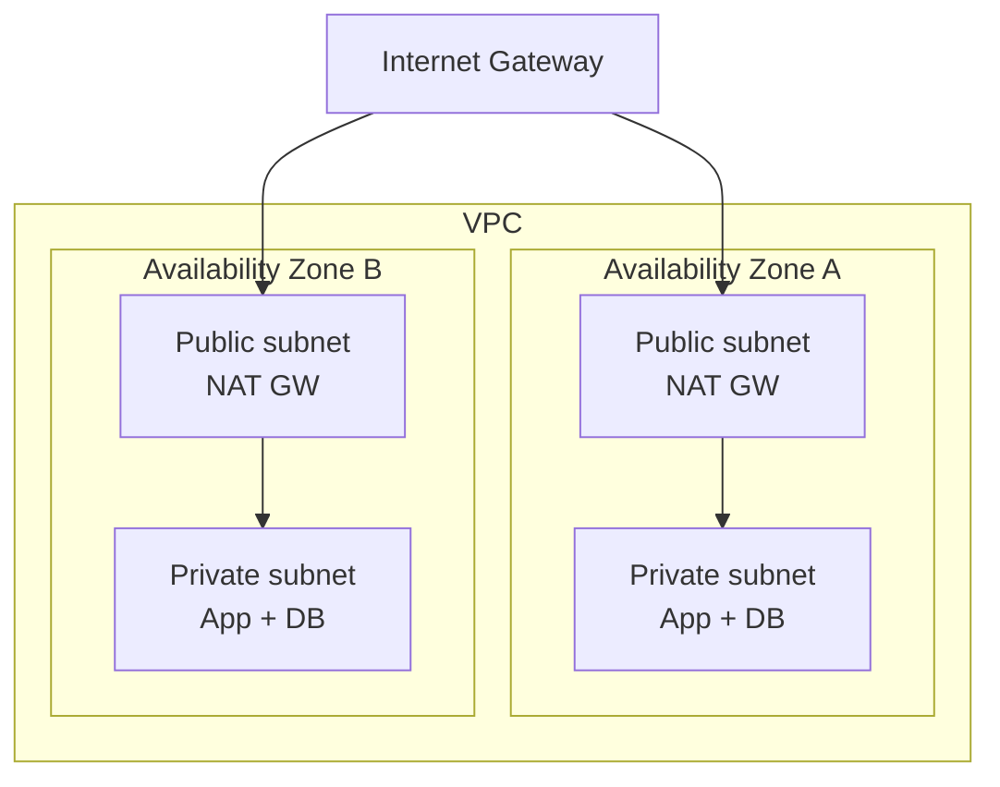
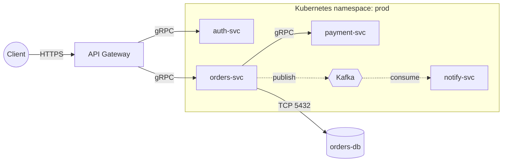
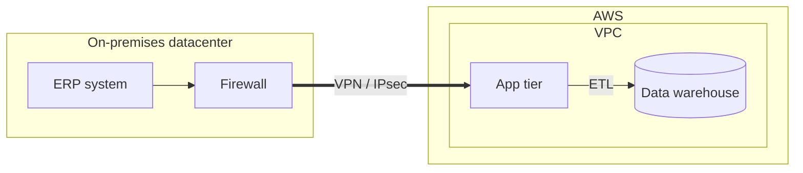
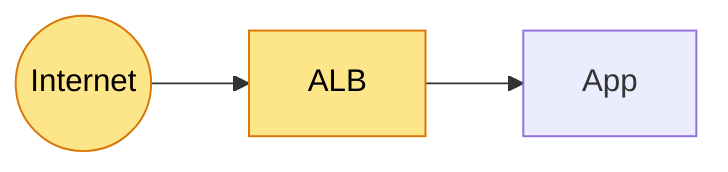
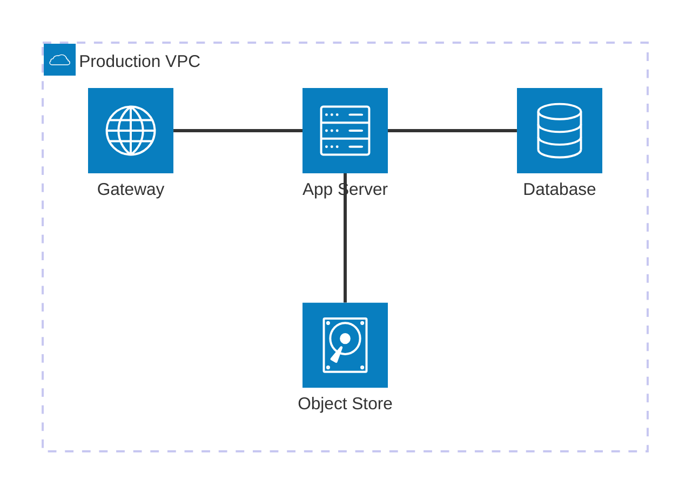

# Mermaid for network & architecture diagrams

Mermaid is the default tool: text-based, renders natively on GitHub, GitLab,
most Markdown viewers, and Claude artifacts with zero install. Two diagram
types cover almost every architecture need.

- **`flowchart`** — the workhorse. `subgraph` blocks give you labeled trust
  zones (VPC, subnets, on-prem), edges carry protocol/port labels, and it
  renders everywhere. Use this by default.
- **`architecture-beta`** — purpose-built for cloud diagrams with grouped
  services and icons. Nicer for high-level "boxes in a cloud" pictures, but
  newer and less universally supported. Use when you want icons and a clean
  grouped look and the render target supports it.

## Table of contents
- [flowchart basics](#flowchart-basics)
- [Recipe: 3-tier web app in a VPC](#recipe-3-tier-web-app-in-a-vpc)
- [Recipe: public/private subnets across AZs](#recipe-publicprivate-subnets-across-azs)
- [Recipe: microservices request flow](#recipe-microservices-request-flow)
- [Recipe: hybrid on-prem to cloud](#recipe-hybrid-on-prem-to-cloud)
- [Styling: mark public-facing / async](#styling)
- [architecture-beta basics](#architecture-beta-basics)

## flowchart basics

Direction: `LR` (left→right, best for request flows) or `TB` (top→bottom,
best for layered stacks). Node shapes carry meaning — use them consistently:

```
flowchart LR
  user((User))                %% (( )) circle = external actor / entry point
  lb[Load Balancer]           %% [ ]   rectangle = service / compute
  db[(PostgreSQL)]            %% [( )] cylinder  = database / datastore
  cache{{Redis}}              %% {{ }} hexagon   = cache / queue
  bucket[/Object Store/]      %% [/ /] parallelogram = storage / external API
```

Edges carry labels — always put the protocol/port or intent on the wire:

```
  user -- HTTPS 443 --> lb
  lb -- HTTP --> app
  app -. async / SQS .-> worker   %% -. .-> dashed = asynchronous
```

Group nodes into labeled boundaries with `subgraph`:

```
flowchart LR
  subgraph vpc["VPC 10.0.0.0/16"]
    subgraph public["Public subnet"]
      alb[ALB]
    end
    subgraph private["Private subnet"]
      app[App servers]
    end
  end
  alb --> app
```

## Recipe: 3-tier web app in a VPC



`a & b & c` fans one edge out to several nodes — concise for a tier of
identical instances.

## Recipe: public/private subnets across AZs



`direction LR` inside a subgraph lays that group out horizontally while the
outer graph stays vertical — useful for placing AZs side by side.

## Recipe: microservices request flow



## Recipe: hybrid on-prem to cloud



`==>` draws a thick edge — handy for emphasizing a primary trunk like a
VPN tunnel or a direct-connect link.

## Styling

Highlight what faces the internet or which paths are asynchronous with
`classDef`. Restraint matters — color should encode one clear fact:



Conventions worth keeping consistent across a set of diagrams: dashed edge =
asynchronous, thick edge = primary/trunk link, a warm fill = public-facing.
If you use them, add a one-line legend node so readers don't have to guess.

## architecture-beta basics

For a clean, grouped, icon-based cloud picture. Built-in icon names include
`cloud`, `database`, `disk`, `internet`, `server`; more are available by
registering an Iconify pack if the target supports it.



Edges attach to a compass side of each node (`:T` `:B` `:L` `:R`), which
lets you control routing. `in api` places a service inside a group. Prefer
`flowchart` when you need edge labels (ports/protocols) — `architecture-beta`
edges are unlabeled — or when the render target may not support the newer
syntax.
